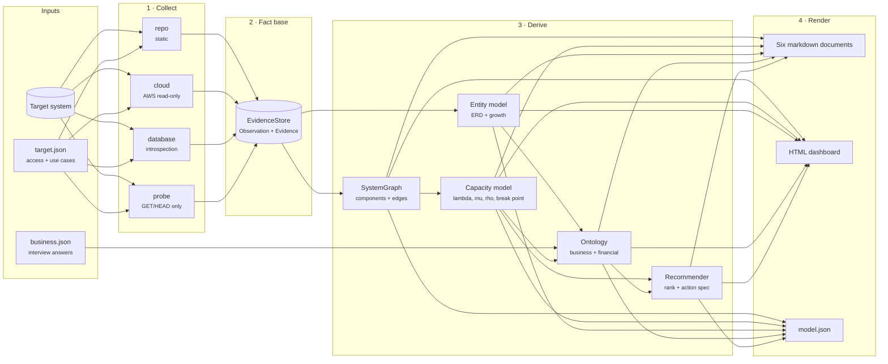
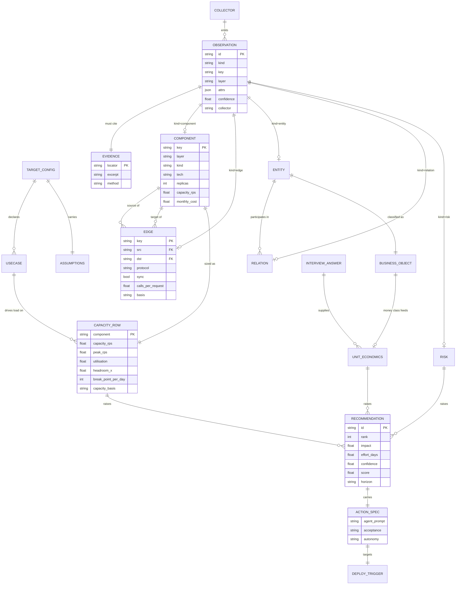

# Analysis Engine — architecture

## Systems architecture

The engine is a four-stage pipeline with one shared fact base. Collectors only
write observations; analyzers only read them; renderers only read the derived
model. Nothing skips a stage, which is what makes the output reproducible from
`00_EVIDENCE.json` alone.

### By layer

| Layer | In this system | Notes |
|---|---|---|
| Front end | `index.html` dashboard, the six markdown documents | Static artefacts; no server |
| Middleware | `ae.cli` — argument parsing, pipeline orchestration | The only place that knows the order of stages |
| Back end | `ae.analyze`, `ae.ontology`, `ae.recommend` | Pure functions over the fact base; no I/O |
| Data | `ae.core.EvidenceStore` and `00_EVIDENCE.json` | The single source of truth for every number |
| Infrastructure | `ae.collect_*` | The only modules that touch the outside world |

The dependency rule runs one way: infrastructure → data → back end → middleware
→ front end. An analyzer that needed a network call would be a design error.

## Entity relationship model

## The one repeating pattern

Everything the engine learns is an `Observation` carrying an `Evidence`.
Collectors differ only in how they produce them; analyzers differ only in what
they read. Adding a fifth collector means writing one `collect(cfg)` function
that returns observations — no other module changes.

## Capacity model

| Quantity | Formula | Basis |
|---|---|---|
| Peak arrival rate | `λ = events_per_day ÷ 86,400 × peak_factor × calls_per_request` | declared use case |
| Service capacity | `μ = replicas × concurrency ÷ service_time` | measured p95 when a probe ran, otherwise assumed |
| Store capacity | `μ = connections ÷ service_time ÷ 4` | pool-bound, not replica-bound |
| Utilisation | `ρ = λ ÷ μ` | derived |
| Queue wait | `Wq = ρ ÷ (μ(1−ρ))` — M/M/1 | derived; explodes as ρ → 1, which is why the target is 0.7 |
| Break point | daily volume where `ρ = 1`, holding traffic mix constant | derived |
| Cost per unit | `monthly_infra_cost ÷ monthly_units` | observed spend, or a declared figure |
| Capacity runway | `ln(break_point ÷ current) ÷ ln(1 + growth)` | needs the interview's growth rate |

Values are stored unrounded and rounded only by the renderer, so every derived
identity in `model.json` holds exactly.

## Recommendation ranking

`score = (impact × confidence) ÷ effort_days`

Impact comes from severity for collected risks, from utilisation for capacity
findings, and from margin for economic findings. Confidence is inherited from
the observation that raised it — an assumed capacity number produces a
lower-confidence recommendation than a measured one, and therefore ranks below
it at equal impact. Each item carries an `ACTION_SPEC` (agent prompt, files,
acceptance test, autonomy level) bound to the `DEPLOY_TRIGGER` detected in the
target repository, so the roadmap is executable rather than advisory.

## Testing

`python3 -m tests.test_smoke` runs 30 checks against `fixtures/acme-lending`,
including the arithmetic identities of the capacity model and the requirement
that every observation carries evidence.
